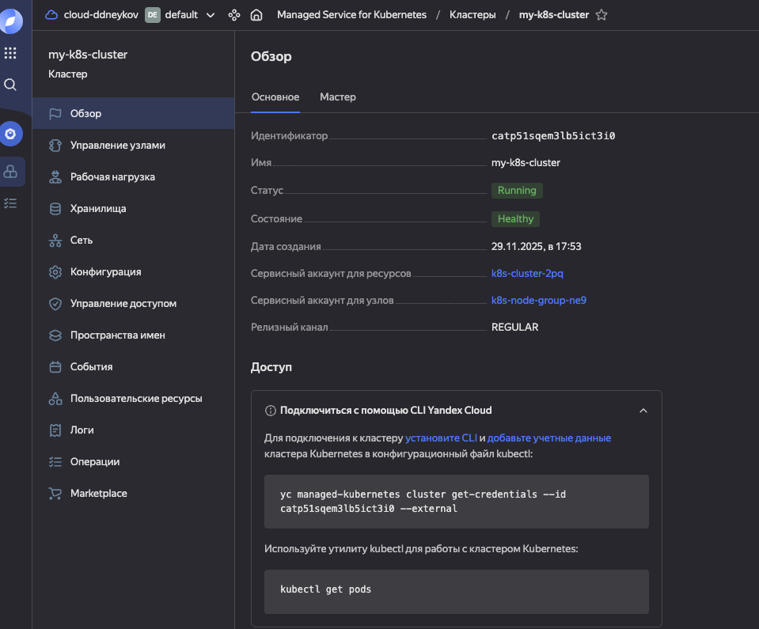
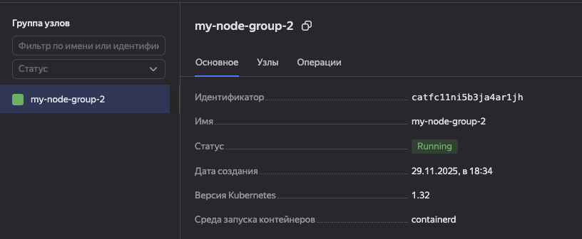
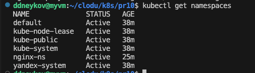
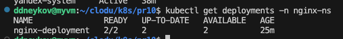
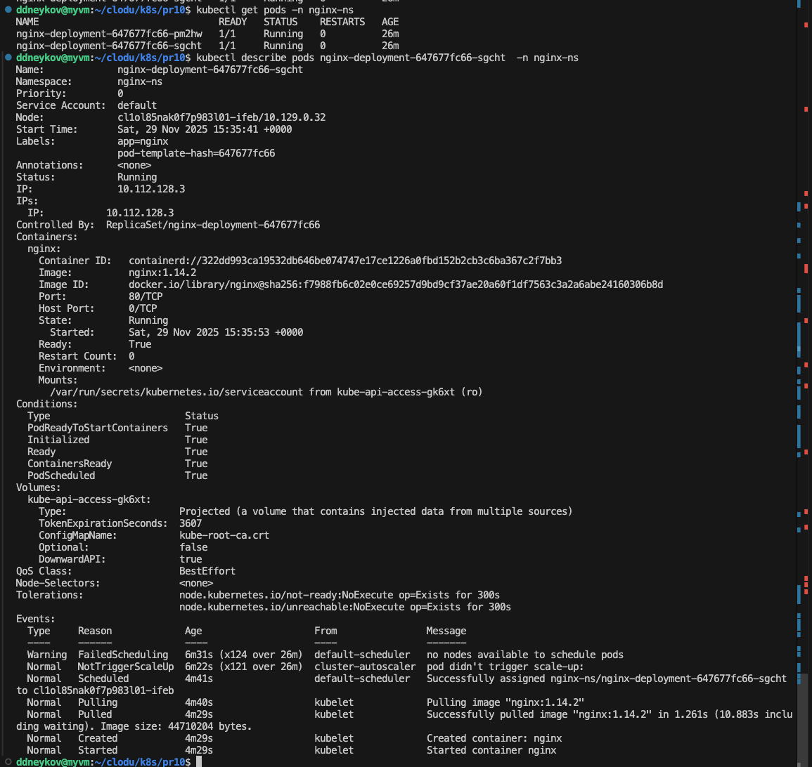
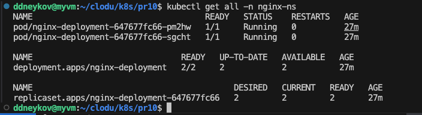
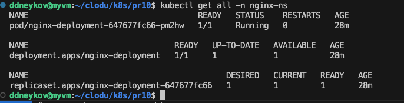

# Артефакты к ПР №10

1. Создали кластер в yandex cloud

2. Создали группу нод

3. Создали неймспейс nginx-ns

4. Применили deployment.yml с spec.replicas: 2

5. Получили описание конкретного пода из деплоя

6. Вывели все сущности из неймспейса

Изменим конфигурационный файл и уменьшим количество реплик с 2 до 1 (spec.replicas: 1)
Применим его
Видим что количество реплик уменьшилось

7. Получим логи пода

