# Артефакты к ПР №11-12

## Часть 1

### Как развернуть деплои

1. Сначала необходимо развернуть `ingress-controller`

```bash
kubectl apply -f https://raw.githubusercontent.com/kubernetes/ingress-nginx/main/deploy/static/provider/cloud/deploy.yaml
```

2. Далее применяем все манифесты

```bash
kubectl apply -f manifests/
```

3. После чего смотрим EXTERNAL_IP, который получил `ingress`

```bash
kubectl get ingress
```

### Артефакты

Исходный код образа бэкенда - https://github.com/cowboymalboro1884/simple-flask-app

Все сущности:

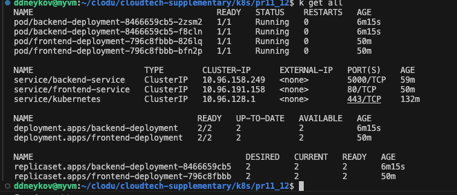

Созданные поды:

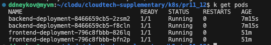

Описание пода бэкенда:

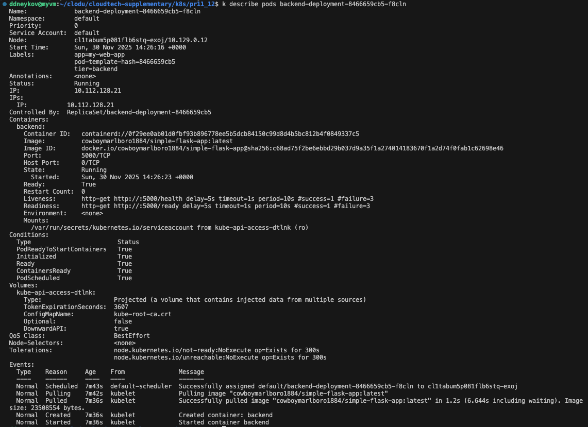

Список svc и ingress

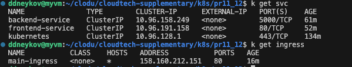

Скриншоты запросов к ингрессу:

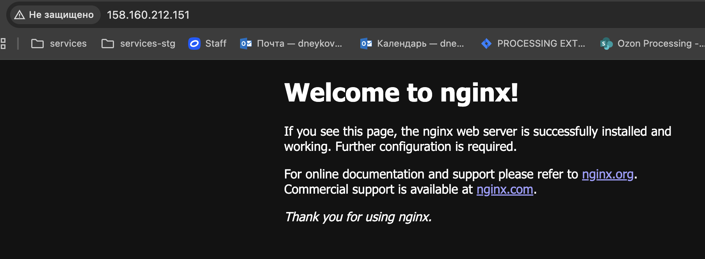

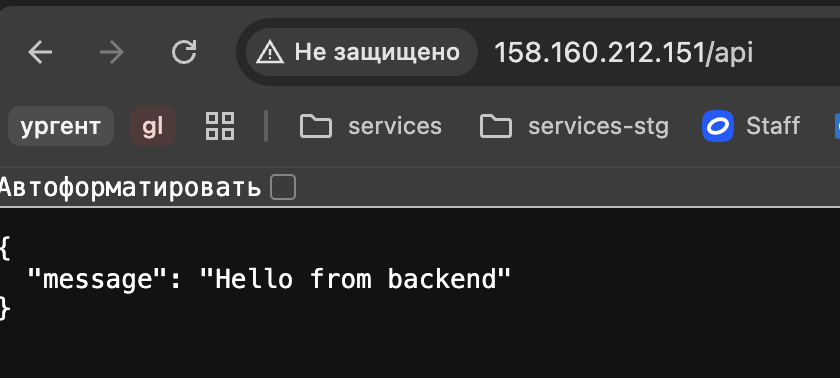

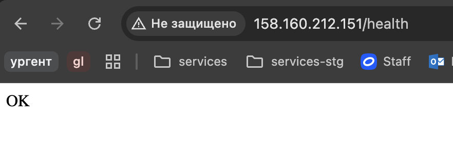

## Часть 2

1. Удалим из предыдущей части, чтобы развернуть заново через helm

```bash
kubectl delete -f manifests/
```

2. Собираем релиз с помощью helm

```bash
helm install my-release ./helm-charts/my-web-app -n production --create-namespace
```

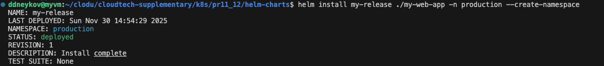

3. Дальше смотрим в Часть 1, получаем EXTERNAL_IP

Чтобы EXTERNAL_IP назначился новому ингрессу, нужно еще раз прописать 
```bash
kubectl apply -f https://raw.githubusercontent.com/kubernetes/ingress-nginx/main/deploy/static/provider/cloud/deploy.yaml
```

4. Проверяем, что всё работает
```bash
curl http://EXTERNAL_IP/
curl http://EXTERNAL_IP/api
curl http://EXTERNAL_IP/health
```

5. Изменяем в values.yaml количество реплик

```bash
helm upgrade my-release ./helm-charts/my-web-app -n production --set frontend.replicaCount=3
```

Видим, что у frontend появился новый под:

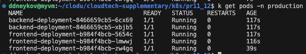

### Артефакты

Все сущности в ns production

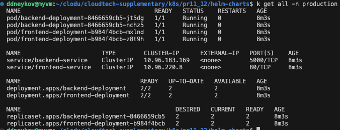

Запросы к сервисам:

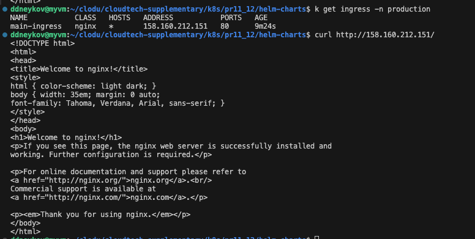

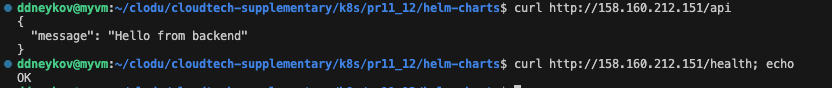