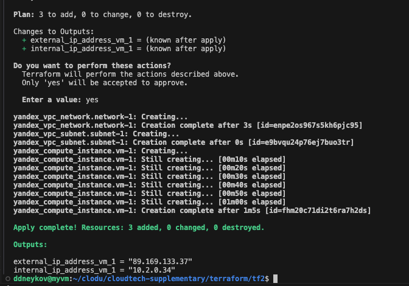
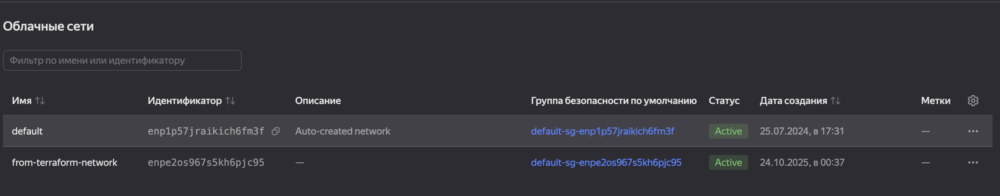
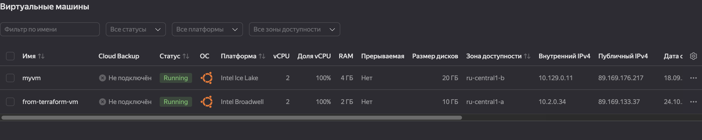
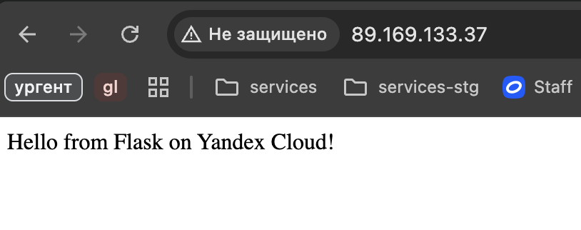

# README

## Сурсы
Конфиги находятся в папке `tf2`
## Артефакты

```
terraform apply -var-file=my-config.tfvars
```



После выполнения команды в UI появились ВМ и сеть





ВМ была загружена из образа прошлой практики с packer'ом.

