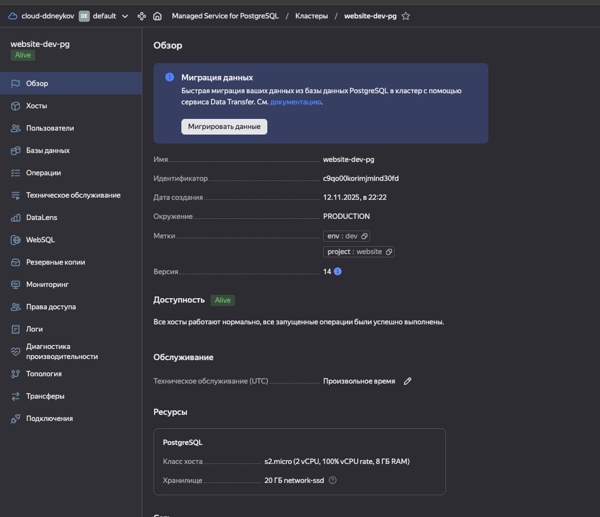
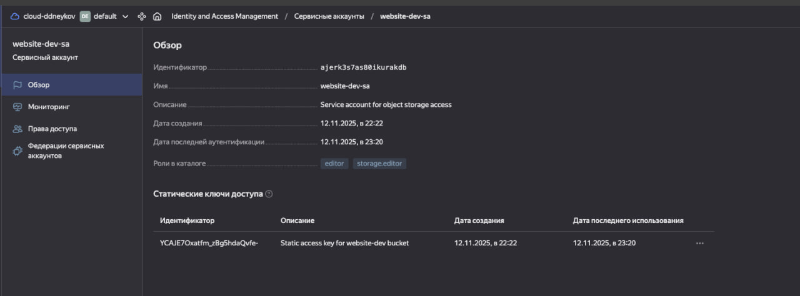
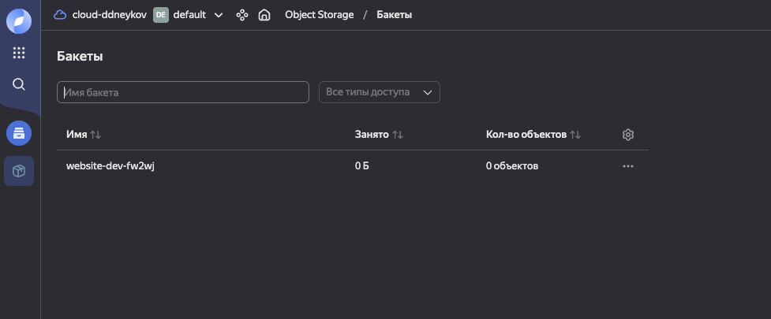
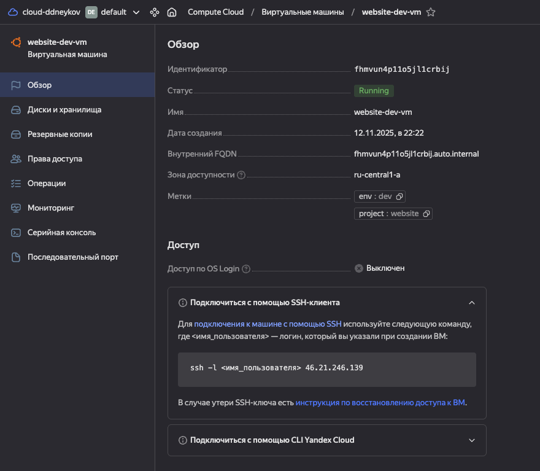
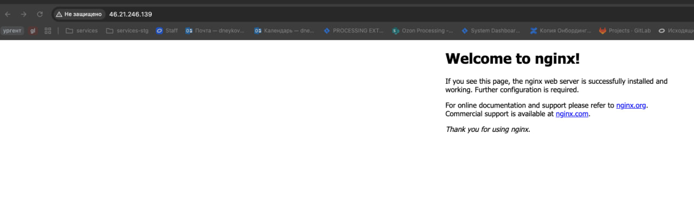
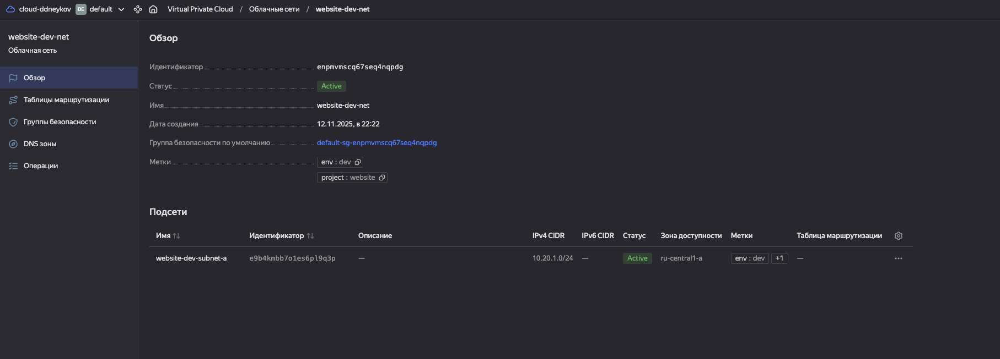

# Терраформ для создания веб-сайта

Для запуска нужно посмотреть в `variables.tf` и переопределить нужные переменные в `terraform.tfvars`.
Обязательные для запуска переменные можно ввести через терминал.

Как запустить
```
terraform apply
```

# Артефакты
### Создаётся ВМ с PostgreSQL


### Создаётся сервисный аккаунт со статическим ключом для доступа к S3 с правами на редактирование


### Создаётся S3


### Создаётся ВМ с предустановленным NGINX



### Создаётся сеть и подсеть
